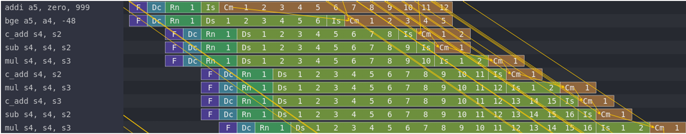

# RISCV Superscalar Processor Simulation  
## Introduction 

In this project, I explore the behavior of superscalar out-of-order processors using the gem5
simulator and the Konata visualization tool. Superscalar processors can issue and execute multiple
instructions per cycle by exploiting instruction-level parallelism (ILP). To investigate how ILP and
microarchitectural parameters affect pipeline performance, I designed two basic test programs: one with
high ILP (independent instructions) and one with low ILP (dependent instruction chains). Each program
was executed under eight different configurations, varying parameters such as fetch width, issue width, commit width, reorder buffer size, and the number of physical registers.  
  
- **Tools**: gem5 RISCV version, RISCV toolchain, Konata pipeline visualizer
- **Microarchitecture configurations v.s results**:

  
  
- **Details**: See [report](./NTU_R13942128.pdf) for detail descriptions.  

## Replicate guideline
- Please refer to [guide](./guide.txt) for environment setup and simulation.   
- All the  test code is under the [code](./code) folder.

